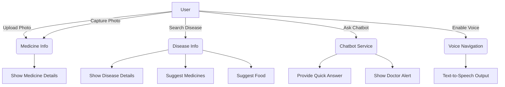
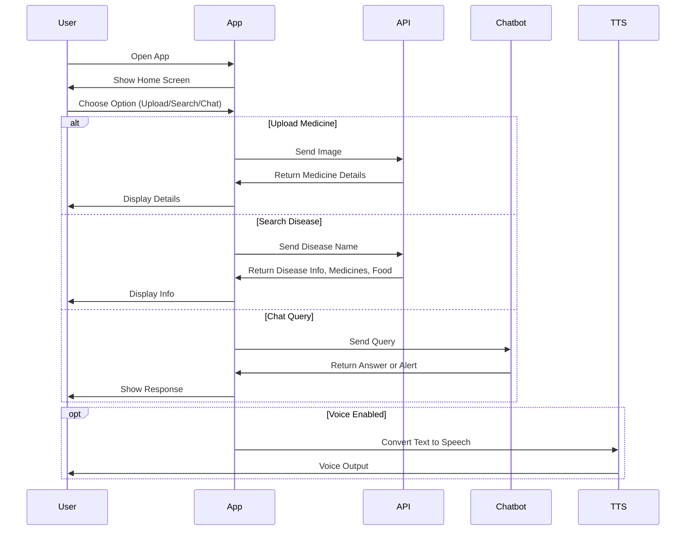

# 📱 **Matrimedis**

**Your Virtual Health Assistant – Powered by Flutter**
Matrimedis is a **Flutter-based healthcare application** that helps users access **medicine details, disease info, diet recommendations, and chat support**. It also supports **multi-language** and **voice navigation** for accessibility.

---

## ✅ **Features**

✔ **Medicine Recognition** – Upload or capture medicine image and get details.
✔ **Disease Info** – Search disease, suggested medicines, and recommended food.
✔ **Virtual Doctor (Chatbot)** – Ask health-related queries, get instant short answers, or doctor alert if critical.
✔ **Multi-language** – English, Hindi, Telugu.
✔ **Voice Navigation** – Text-to-Speech for illiterate users.
✔ **HTTP-based API integration** for real-time data.

---

## 🛠 **Tech Stack**

* **Flutter (Dart)** for UI
* **HTTP** for API calls
* **Text-to-Speech (TTS)**
* **Image Picker** for photo capture/upload
* **ML Integration** for medicine recognition & chatbot logic

---

## 🧩 **Diagrams**

### ✅ **Use Case Diagram (Mermaid)**



---

### ✅ **Sequence Diagram (Mermaid)**



---

## 📺 **Demo Video**

[](https://youtu.be/WQH22xsKI5A?si=GdYygz6WhKQgQ5uq)


---

## 🚀 **How to Run**

```bash
git clone https://github.com/jayanth119/matrimedis.git
cd matrimedis
flutter pub get
flutter run
```

---

## 🌐 **Future Enhancements**

* **AI-based Symptom Checker**
* **Telemedicine Integration**
* **Offline Mode for Medicine Data**

---

## 🏷 **Version**

* **1.0** – Multi-language, Voice Navigation, Chatbot, Medicine & Disease Info.

---
